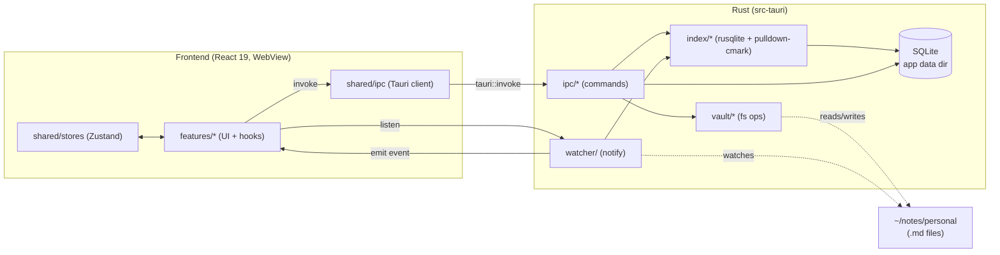

# Architecture

**Pattern:** Tauri desktop app — Rust backend (capabilities/IPC) + React 19 SPA frontend. Feature-folder architecture on the JS side; module-per-concern on the Rust side.

## High-Level Structure

## Identified Patterns

### Feature folder

**Location:** `src/features/<feature>/`
**Purpose:** Each user-facing capability owns its UI + hooks + feature-local services.
**Implementation:** Inside a feature: `ui/` (components), `hooks/` (logic glue), `services/` (calls into `shared/ipc`), and an `index.ts` that re-exports the public API.
**Example:** F06 Home → `src/features/home/{ui,hooks,services,index.ts}`.

### Shared kernel

**Location:** `src/shared/`
**Purpose:** Cross-feature primitives, stores, IPC client, types. Anything used by 2+ features.
**Subfolders:**
- `ui/` — generic primitives (Button, Card, Kbd, Drawer, IconButton, …)
- `stores/` — Zustand stores (`vaultStore`, `recentsStore`, `paletteStore`, …)
- `ipc/` — typed wrappers around `tauri.invoke` per command in `IpcContract.ts`
- `md/` — markdown helpers consumed by both editor and preview
- `types/` — shared types (`Note`, `Vault`, `Tag`, IPC types)

### Tauri IPC contract

**Location:** `src/shared/ipc/IpcContract.ts` + `src-tauri/src/ipc/mod.rs`
**Purpose:** Single source of truth for every command's name, payload, and result.
**Implementation:** TS file lists `type Commands = { 'vault.open': { input: …; output: … } … }`. Rust handlers use `serde` types with matching field names. A small `cargo test` in `src-tauri/tests/` deserializes a fixture per command to verify shape.
**Example:** `'vault.open' → { path: string } → { id: string; recents: Vault[] }`.

### Indexer reactivity

**Location:** `src-tauri/src/index/`
**Purpose:** Keep SQLite in sync with the vault filesystem.
**Implementation:** `notify` watcher emits FS events → debouncer (200 ms) → indexer applies a diff (insert/update/delete rows for changed files). On boot, full scan if the index is empty or stale.

## Data Flow

### Open vault → render Home

1. User picks folder in `dialog.open()` → frontend calls `vault.open` IPC.
2. Rust persists the vault id, scans the folder, populates SQLite if missing.
3. Frontend receives `{ id, recents }`, hydrates `vaultStore`.
4. Home reads from `vaultStore` + queries `index.list({ limit, sort })` via IPC.
5. Cards render.

### Edit a note → autosave → reindex

1. User types in CodeMirror.
2. CM6 update listener calls `notes.save` IPC (debounced 500 ms).
3. Rust writes the file atomically (`tempfile + rename`).
4. `notify` sees the change, emits `vault://changed` (Rust filters out our own writes via path+size+mtime fingerprint).
5. Indexer reparses just that file, upserts rows.
6. Frontend `noteStore` invalidates derived selectors (backlinks, outline).

### Click a wikilink → navigate

1. CM6 wikilink decoration registers a click handler.
2. Click → call `links.resolve(targetTitle)` → returns `{ noteId } | null`.
3. If hit: route to `note(noteId)`.
4. If miss: prompt "Criar nova nota?" → call `notes.create({ title })` → route.

## Code Organization

**Approach:** Feature-based on the frontend, module-based on the backend. No layered architecture (no `controllers/`/`services/`/`repositories/`); we group by what they DO, not what kind of code they ARE.

**Module boundaries:**
- A feature folder MAY import from `shared/*`. It MUST NOT import from another feature folder. Cross-feature collaboration goes through Zustand stores or shared types.
- `src-tauri/src/ipc/` is the only module that defines public commands. `vault`, `index`, `watcher` are internal — they expose Rust functions but no Tauri commands directly.
