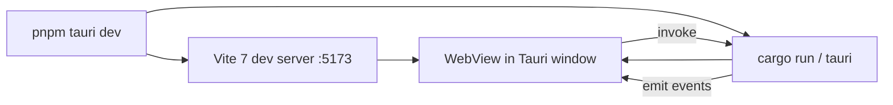

# F01 — Foundation Design

**Spec:** `.specs/features/F01-foundation/spec.md`
**Status:** Draft

---

## Architecture Overview

A standard Tauri 2 + Vite 7 + React 19 monorepo (single package, not workspace). `src-tauri/` holds Rust; `src/` holds the React app. Tailwind v4 is wired via the official Vite plugin (`@tailwindcss/vite`) — no PostCSS, no `tailwind.config.js`.

## Code Reuse

| Component                   | Location                | How to Use                                    |
| --------------------------- | ----------------------- | --------------------------------------------- |
| Layout C shell              | `prototype/src/...`     | Copy components into `src/features/*` 1:1     |
| Tailwind `@theme` tokens    | `prototype/src/index.css` | Move into `src/index.css`, refine if needed |
| Mock data                   | `prototype/src/data/mock.ts` | Move to `tests/fixtures/mock-data.ts` and re-export from there for the migration phase |
| MockMarkdown                | `prototype/src/components/MockMarkdown.tsx` | Move to `src/features/editor/ui/MockMarkdown.tsx` (will be replaced by real editor in F05) |

## Components

### App shell

- **Purpose:** Boot React, wire global providers, route between `home` and `note(id)`.
- **Location:** `src/app/`
- **Files:** `App.tsx`, `Providers.tsx`, `main.tsx`.
- **Dependencies:** `react`, `react-dom`.

### Tauri main

- **Purpose:** Launch Tauri, register IPC commands (placeholder for now), set up WebView config.
- **Location:** `src-tauri/src/main.rs`, `src-tauri/src/lib.rs`.
- **Dependencies:** `tauri = "2"`.

### CI workflows

- **Purpose:** Enforce quality + build releases.
- **Location:** `.github/workflows/quality.yml`, `.github/workflows/release.yml`.

## Tech Decisions

| Decision                       | Choice                                              | Rationale                                                                 |
| ------------------------------ | --------------------------------------------------- | ------------------------------------------------------------------------- |
| Path alias                     | `@/` → `./src`                                      | Standard pattern; ESLint-friendly                                         |
| ESLint config                  | Flat config (`eslint.config.js`)                    | ESLint 9 default; matches Tolaria                                         |
| Tauri window default size      | 1280×800                                            | Comfortable for Layout C three-column flow                                |
| Vite plugin order              | `react()`, then `tailwindcss()`                     | Tailwind v4 plugin must run after Vite resolves `.css` imports            |
| `husky` install path           | `pnpm prepare` script                               | pnpm-friendly                                                             |
| Bundle budget enforcement      | A simple `vite-bundle-visualizer` step in CI        | Lightweight; doesn't gate yet, just reports                               |

## Risks

- **Tailwind v4 + Vite 7** — both very new; if compatibility breaks, fall back to Tailwind v3 with PostCSS. Track via R-NNN if it bites.
- **Tauri 2 GA on Windows ARM** — not all features stable; we ship x64 first.
