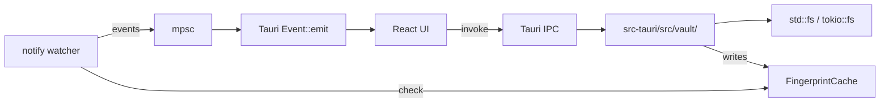

# F02 — Vault FS Design

**Spec:** `.specs/features/F02-vault-fs/spec.md`

## Architecture



## IPC Contract (additions to `IpcContract.ts`)

```ts
namespace vault {
  open(): Promise<{ path: string }>             // OS picker
  current(): Promise<{ path: string } | null>
  list(): Promise<NoteEntry[]>
  watcherStart(): Promise<void>                 // idempotent
  watcherStop(): Promise<void>
}
namespace notes {
  read(path: string): Promise<NoteFile>
  save(input: SaveInput): Promise<{ path: string; mtime: number }>
  create(folder: string, title?: string): Promise<{ path: string }>
  rename(oldPath: string, newName: string): Promise<{ path: string }>
  trash(path: string): Promise<void>
}
```

Events emitted (snake-cased on the Rust side, camelCase in TS adapter):
- `vault.opened` `{ path }`
- `vault.fileChanged` `{ path, kind: 'created'|'modified'|'removed', source: 'internal'|'external', mtime, size }`
- `vault.fileRenamed` `{ oldPath, newPath }`

## Components

### `vault/mod.rs`

- Holds `VaultState` (path, watcher handle, fingerprint cache).
- One global instance via `tauri::State`.

### `vault/list.rs`

- Walks dir with `walkdir` crate skipping hidden, non-md, symlinks.
- Returns `Vec<NoteEntry>`.

### `vault/io.rs`

- `read_note`, `save_atomic` (writes to `*.tmp.<rand>` then `rename`), `create_note`, `rename_note`, `trash_note` (uses `trash` crate).

### `vault/frontmatter.rs`

- Parses YAML frontmatter using `serde_yaml`. Pure function with unit tests.

### `vault/watcher.rs`

- Uses `notify::recommended_watcher`. Debounces with `notify-debouncer-mini`.
- For each event, computes the file's `(size, mtime)` and looks up `FingerprintCache::pop_recent(path)`. If matches → drop (it was our own write). Else → emit external.

### `vault/fingerprint.rs`

- `Mutex<HashMap<PathBuf, (u64, SystemTime, Instant)>>`. Entries TTL'd at 2 s.

## Data Models

```rust
pub struct NoteEntry {
    pub id: String,        // sha1 of absolute path, hex
    pub path: PathBuf,
    pub title: String,
    pub folder: String,
    pub size: u64,
    pub mtime: i64,        // unix ms
}

pub struct NoteFile {
    pub path: PathBuf,
    pub frontmatter: serde_json::Value,
    pub body: String,
    pub mtime: i64,
}

pub struct SaveInput {
    pub path: PathBuf,
    pub frontmatter: serde_json::Value,
    pub body: String,
    pub expected_mtime: Option<i64>,  // optimistic lock; if mismatch → IpcError::Conflict
}
```

## Error Handling

`IpcError` extended:
- `Io(String)`
- `NotFound`
- `Parse(String)`
- `Conflict { current_mtime: i64 }`

All commands return `Result<T, IpcError>`. Errors serialize to JSON and surface as toasts in the UI (handled by the global IPC adapter).

## Risks (referencing CONCERNS.md)

- **R-002 watcher echo** — handled by `FingerprintCache`. Test plan: write 100 files in 1 s and assert zero `external` events emitted.
- **R-005 large vault scan** — mitigated by streaming results page-by-page if listing > 1 s. Defer until benchmarks fail.

## Tech Decisions

| Decision                     | Choice                                        | Rationale                                |
| ---------------------------- | --------------------------------------------- | ---------------------------------------- |
| Walker                       | `walkdir` 2                                   | Simplest, well-known                     |
| Watcher                      | `notify` 6 + `notify-debouncer-mini`          | Cross-platform, already in Tolaria stack |
| Frontmatter                  | `serde_yaml`                                  | Stable; YAML is the de-facto format      |
| Trash                        | `trash` crate                                 | Cross-platform                           |
| Path → ID                    | sha1 hex of canonicalized absolute path       | Stable across renames? No — reindex on rename |
| Optimistic concurrency       | `expected_mtime` in SaveInput                 | Avoids overwrites on stale buffers       |
