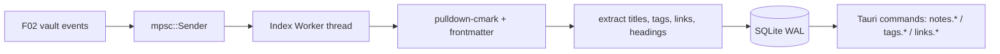

# F03 — Index Design

**Spec:** `.specs/features/F03-index/spec.md`

## Architecture



## Schema (`src-tauri/src/index/schema.sql`)

```sql
PRAGMA journal_mode = WAL;
PRAGMA synchronous = NORMAL;
PRAGMA foreign_keys = ON;

CREATE TABLE IF NOT EXISTS schema_version (version INTEGER NOT NULL);

CREATE TABLE IF NOT EXISTS notes (
  id          TEXT PRIMARY KEY,
  path        TEXT NOT NULL UNIQUE,
  folder      TEXT NOT NULL,
  title       TEXT NOT NULL,
  size        INTEGER NOT NULL,
  mtime       INTEGER NOT NULL,
  created     INTEGER,                -- from frontmatter, unix ms
  updated     INTEGER,
  body_hash   TEXT NOT NULL           -- sha1, used to skip reparse on no-op events
);
CREATE INDEX idx_notes_mtime ON notes(mtime DESC);
CREATE INDEX idx_notes_folder ON notes(folder);

CREATE TABLE IF NOT EXISTS tags (
  tag         TEXT PRIMARY KEY
);

CREATE TABLE IF NOT EXISTS note_tags (
  note_id     TEXT NOT NULL REFERENCES notes(id) ON DELETE CASCADE,
  tag         TEXT NOT NULL REFERENCES tags(tag) ON DELETE CASCADE,
  PRIMARY KEY (note_id, tag)
);
CREATE INDEX idx_note_tags_tag ON note_tags(tag);

CREATE TABLE IF NOT EXISTS links (
  src_note_id TEXT NOT NULL REFERENCES notes(id) ON DELETE CASCADE,
  target_text TEXT NOT NULL,           -- raw [[target]] text, unresolved
  target_id   TEXT,                    -- resolved note id (F09)
  position    INTEGER NOT NULL,        -- char offset in body
  alias       TEXT
);
CREATE INDEX idx_links_src ON links(src_note_id);
CREATE INDEX idx_links_target_id ON links(target_id);
CREATE INDEX idx_links_target_text ON links(target_text);

CREATE TABLE IF NOT EXISTS frontmatter (
  note_id TEXT NOT NULL REFERENCES notes(id) ON DELETE CASCADE,
  key     TEXT NOT NULL,
  value   TEXT NOT NULL,               -- JSON-encoded
  PRIMARY KEY (note_id, key)
);

CREATE VIRTUAL TABLE IF NOT EXISTS notes_fts USING fts5(
  id UNINDEXED,
  title,
  body,
  tokenize = 'porter unicode61'
);
```

## Components

### `index/mod.rs`

- `IndexState` (rusqlite Connection in `Mutex`, worker `Sender`).

### `index/migrate.rs`

- Reads `schema_version`. If absent → run schema.sql + insert 1. Future migrations follow same pattern.

### `index/parser.rs`

- `parse(text) -> ParsedNote { title, body_for_search, headings, tags, links, body_hash }`.
- Uses `pulldown-cmark` events; skips tags/links inside `Code`/`CodeBlock` events.
- Tag regex: `(?<![A-Za-z0-9/_-])#([A-Za-z0-9][A-Za-z0-9/_-]{0,63})`.
- Link regex (after pulldown-cmark text accumulation): `\[\[([^\[\]\|]+?)(?:\|([^\[\]]+?))?\]\]`.

### `index/worker.rs`

- Owns the `Receiver<IndexJob>`. Job types: `BuildAll`, `Upsert(path)`, `Remove(path)`, `Rename(old, new)`.
- Inside an SQL transaction per job. Emits `index.progress` events.

### `index/query.rs`

- Pure read queries. Each query is a function `(&Conn, args) -> Vec<...>`.

## IPC additions

```ts
namespace notes {
  recent(limit?: number): Promise<NoteEntry[]>
  byTag(tag: string): Promise<NoteEntry[]>
  byFolder(prefix: string): Promise<NoteEntry[]>
  byId(id: string): Promise<NoteEntry | null>
}
namespace tags {
  list(): Promise<{ tag: string; count: number }[]>
}
namespace links {
  outgoing(noteId: string): Promise<LinkRow[]>
  incoming(noteId: string): Promise<LinkRow[]>
}
namespace index {
  rebuild(): Promise<void>      // explicit user action
}
```

Events:
- `index.progress { processed, total, phase }`
- `index.ready`
- `index.error { message }`

## Two-parser parity

JS-side parser (`src/shared/parsers/markdown.ts`) extracts the same { tags, links, headings } via `unified` + `remark-gfm` + `remark-wikilink`. CI test compares JSON output of Rust vs JS over the fixture vault — must be byte-equal after canonical sort.

## Decisions

| Decision           | Choice                          | Rationale                                |
| ------------------ | ------------------------------- | ---------------------------------------- |
| SQLite driver      | `rusqlite` with `bundled` feature | Self-contained; matches AD-004           |
| Async story        | One worker thread + std mpsc    | Simpler than tokio; index work is CPU+IO |
| Hashing            | sha1 of body                    | Cheap; "no real change" detection        |
| Event throttling   | At most 1 progress per 100 ms   | UI-friendly                              |
| Concurrency        | One write at a time             | WAL handles readers; writers serialized  |
