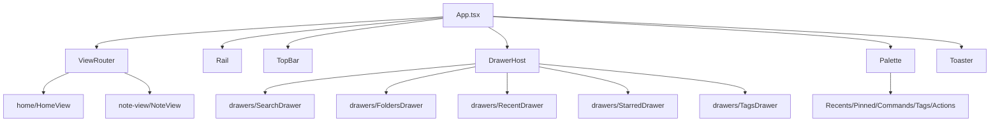

# F04 — Shell Design

**Spec:** `.specs/features/F04-shell/spec.md`

## Architecture



## State

`shellStore` (Zustand):
```ts
{
  view: { kind: 'home' } | { kind: 'note', id: string } | { kind: 'empty' };
  history: View[]; cursor: number;
  drawer: null | 'search' | 'folders' | 'recent' | 'starred' | 'tags';
  paletteOpen: boolean;
  helpOpen: boolean;
  toasts: Toast[];
  navigate(view: View): void;
  back(): void; forward(): void;
  toggleDrawer(d: DrawerId): void;
  closeDrawer(): void;
  openPalette(): void; closePalette(): void;
  pushToast(t: Toast): void;
}
```

Persistence: `view`, `drawer` to `tauri-plugin-store` on every change (debounced 300 ms).

## Components (per CONVENTIONS feature folder layout)

```
src/features/shell/
  ui/
    Rail.tsx           — vertical icon column, aria-label per button
    TopBar.tsx
    DrawerHost.tsx     — handles outside-click + Esc + focus trap (uses focus-trap-react)
    CommandPalette.tsx — built on cmdk
    Toaster.tsx        — Radix Toast or sonner
    HelpModal.tsx
    EmptyVault.tsx
  hooks/
    useShortcuts.ts    — global keymap; respects input focus
    useViewRouter.ts
  state/shellStore.ts
  index.ts             — exports <Shell />
```

## Library choices

| Concern         | Library                                | Reason                                 |
| --------------- | -------------------------------------- | -------------------------------------- |
| Palette         | `cmdk`                                 | Best-in-class API, used by Vercel/Linear |
| Focus trap      | `focus-trap-react`                     | Accessible, small                      |
| Toasts          | `sonner`                               | Smaller than Radix, ergonomic API      |
| Shortcuts       | `tinykeys`                             | Tiny, accurate, cross-platform mod keys |
| Fuzzy search    | `fuzzysort`                            | Fast, good ranking                     |

## Palette source aggregation

```ts
type PaletteItem =
  | { kind: 'note'; id: string; title: string; folder: string }
  | { kind: 'tag'; tag: string; count: number }
  | { kind: 'command'; id: string; label: string; run(): void }
  | { kind: 'action'; id: 'open-vault' | 'new-note' | 'rebuild-index' | ...; label: string };
```

Aggregator subscribes to `vaultStore.notes`, `indexStore.tags`, and a static `commandsRegistry`. Re-ranks on input via `fuzzysort` over `title + folder + tag`.

## Routing

No router library. `shellStore.view` is the single source. URL/deep links deferred (v2). On `navigate` we push a clone into `history` and bump `cursor`.

## Accessibility

- Each rail button: `aria-label`, `aria-pressed` when its drawer is open.
- Palette: `role="dialog"`, `aria-modal="true"`, `aria-label="Command palette"`.
- Drawer: `role="region"`, `aria-label="<DrawerName>"`.
- All interactive elements reachable by keyboard; focus ring visible (Tailwind `focus-visible:ring-2`).

## Risks

- Shortcut collisions with platform defaults (Cmd+W = close window). Whitelist only documented combos.
- Cmdk + focus-trap interaction: ensure we mount palette portal outside drawer DOM.
