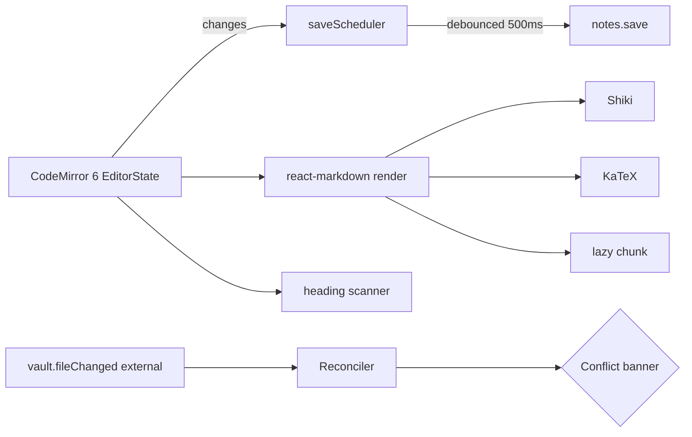

# F05 — Editor Design

**Spec:** `.specs/features/F05-editor/spec.md`

## Architecture



## Why CodeMirror 6 (not Monaco/BlockNote)

- Vault stays plain `.md` (AD-006 — no BlockNote).
- CM6 is modular, performant, accessible, has Markdown + autocomplete extensions, and is what Obsidian uses too.
- BlockNote would require a roundtrip transform to Markdown — risk of lossy edits.

## Components

```
src/features/editor/
  ui/
    Editor.tsx          — wraps CM6 EditorView
    Preview.tsx         — react-markdown + plugins
    EditorPreviewSplit.tsx
    SaveIndicator.tsx
    ConflictBanner.tsx
  cm/
    extensions.ts       — bundles markdown(), keymap, highlight, autocomplete, theme
    wikilinkAutocomplete.ts
    tagAutocomplete.ts
    slashMenu.ts
    concealedBrackets.ts
    headingSizes.ts
    theme.ts            — Tailwind-token-aware
  preview/
    plugins.ts          — remark/rehype plugin chain
    shikiHighlighter.ts
    mermaidRenderer.ts
    katexRenderer.ts
  hooks/
    useEditorBuffer.ts  — load/save lifecycle
    useAutoSave.ts
    useExternalReconciler.ts
  state/editorStore.ts  — { activeNoteId, buffers: Map<id, BufferState> }
```

## Buffer state

```ts
type BufferState = {
  noteId: string;
  path: string;
  body: string;
  loadedMtime: number;
  dirty: boolean;
  lastSavedAt: number | null;
  inFlightSave: Promise<void> | null;
  pendingSave: boolean;
  conflict: { externalMtime: number } | null;
};
```

## Save scheduler

- Debounce 500 ms per buffer.
- On flush: if `inFlightSave`, set `pendingSave = true` and return; on completion, re-flush.
- Sends `expected_mtime: loadedMtime`. If `Conflict` → set `conflict` state and stop scheduler until resolved.

## External reconciler

- Subscribes to `vault.fileChanged` for the active buffer's path.
- If `source === 'external'` and we have a dirty buffer → set `conflict`.
- If `source === 'external'` and not dirty → reload silently (`notes.read`) and update buffer.

## Preview pipeline

```
markdown source
 → unified()
 → remark-parse
 → remark-gfm
 → remark-math
 → remark-wikilink (custom)
 → remark-rehype
 → rehype-katex
 → rehype-shiki (lazy import) — falls back to plain pre on error
 → custom rehype-mermaid (lazy)
 → react-markdown components mapping (links, checkboxes, headings → ids for outline)
```

## Library choices

| Concern             | Library                                           |
| ------------------- | ------------------------------------------------- |
| Editor              | `@codemirror/state`, `@codemirror/view`, `@codemirror/lang-markdown`, `@codemirror/autocomplete`, `@codemirror/commands` |
| Highlighting (cm)   | `@lezer/markdown` + custom decorations            |
| Highlighting (preview) | `shiki` 1.x with `vitesse-light`               |
| Math                | `katex` + `rehype-katex` + `remark-math`          |
| Diagrams            | `mermaid` (dynamic import)                        |
| Markdown preview    | `react-markdown`, `remark-gfm`                    |

## Performance

- Editor chunk lazy-loaded: `const Editor = lazy(() => import('./ui/Editor'))`.
- Mermaid + Shiki dynamically imported on first need.
- Preview throttled with `requestIdleCallback` fallback.

## Risks (CONCERNS.md)

- **R-001 parser parity** — wikilink/tag extensors used in preview must match Rust indexing. Already covered by F03 parity test.
- **Auto-save vs external watcher** — covered by reconciler; chaos test required.
- **Large file** — degraded mode disables Mermaid/KaTeX above 1 MB.
