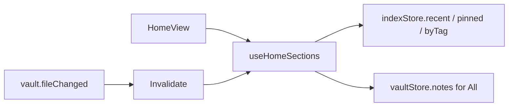

# F06 — Home Design

**Spec:** `.specs/features/F06-home/spec.md`

## Components

```
src/features/home/
  ui/
    HomeView.tsx
    HomeHero.tsx
    PinnedGrid.tsx
    RecentsList.tsx
    TagPills.tsx
    AllNotesGrid.tsx
    NoteCard.tsx
    NoteCardMenu.tsx
    Skeletons.tsx
  hooks/
    useHomeSections.ts
    usePinToggle.ts
  state/homeStore.ts   — only ephemeral (selected pill, page cursor)
```

## Data flow



## Pinned implementation

`indexStore` exposes a derived `pinnedNotes` selector backed by a query: `SELECT * FROM notes JOIN frontmatter ON note_id = id WHERE key = 'pinned' AND value = 'true' ORDER BY mtime DESC LIMIT 6`. (F03 already has the `frontmatter` table.)

## Card menu

Built on Radix `DropdownMenu`. Actions delegate to small services:
- `pinService.toggle(noteId)` reads → toggles → calls `notes.save` (F02 atomic).
- `revealInFolders(noteId)` calls `shellStore.toggleDrawer('folders')` and a `foldersStore.scrollTo(folder)`.

## Pagination

`AllNotesGrid` uses an `IntersectionObserver` sentinel; when intersecting, increments page cursor. Query: `notes.allPaged(offset, limit)` (added to F03 if missing — see F06-T02).

## Library choices

| Concern        | Library                |
| -------------- | ---------------------- |
| Context menu   | `@radix-ui/react-dropdown-menu` |
| Virtualization | None for v1; limit page size = 30 |
| Date formatting | `date-fns` (already in tolaria stack) |

## A11y

- `NoteCard` is a `<button>` (or `<a>` if note links become URLs). Keyboard activatable.
- `TagPills` are `<button>` with `aria-pressed` when selected.

## Risks

- Re-render storms on `vault.fileChanged` for unrelated files. Use selective subscriptions: each hook subscribes only to events whose path falls in its section's note set (looked up in `vaultStore`).
