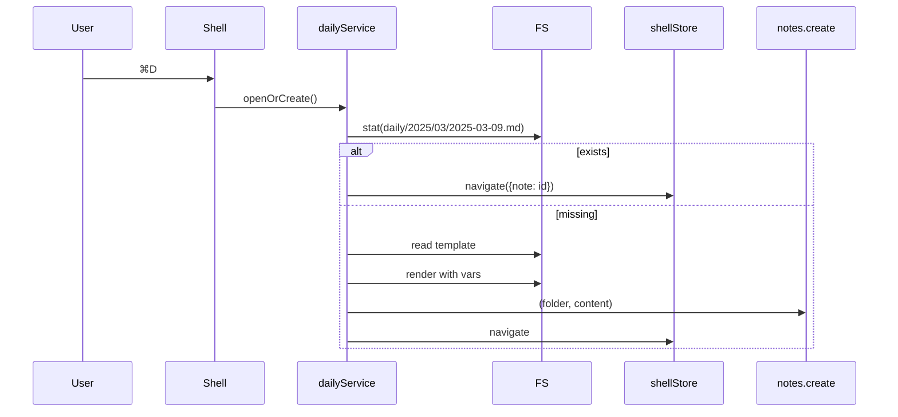
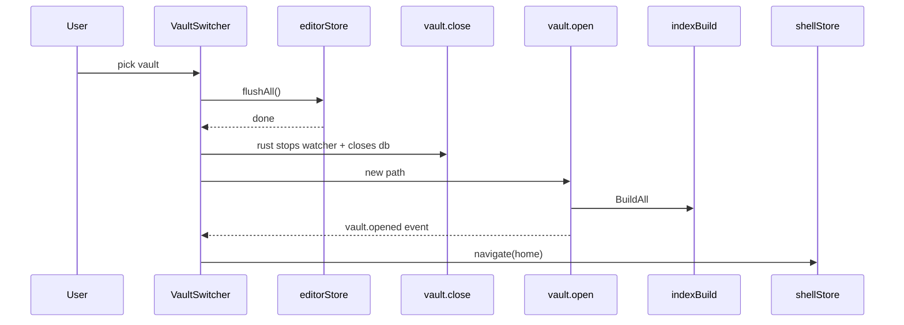

# F10 — Daily Notes & Multi-Vault Design

## Daily

### Components
```
src/features/daily/
  ui/                    — none; commands only
  services/
    dailyService.ts      — computePath(now, pattern), renderTemplate, openOrCreate
  templates/
    builtinDaily.md      — bundled fallback
```

### Flow


### Path pattern grammar
Tokens: `YYYY YY MM DD HH mm`. Anything else literal. Validated by tests.

## Multi-Vault

### Components
```
src/features/vault-switcher/
  ui/
    VaultSwitcher.tsx     — dropdown in TopBar (replaces vault label)
    VaultListItem.tsx
  state/
    recentVaultsStore.ts  — persisted via tauri-plugin-store
  services/
    switchVault.ts        — orchestrates flush + close + open
```

### Switch sequence


### IPC additions
```ts
namespace vault {
  close(): Promise<void>
  recent(): Promise<RecentVault[]>
  removeRecent(path: string): Promise<void>
}
```

### Per-vault config
File `<vault>/.noxe/config.json` carries `dailyPathPattern`, etc. Loaded on open. Defaults applied if missing.

### Risks
- Editor buffers lost on switch → `editorStore.flushAll()` must succeed before close.
- Watcher cleanup races → `vault.close` must `join` the watcher thread.
