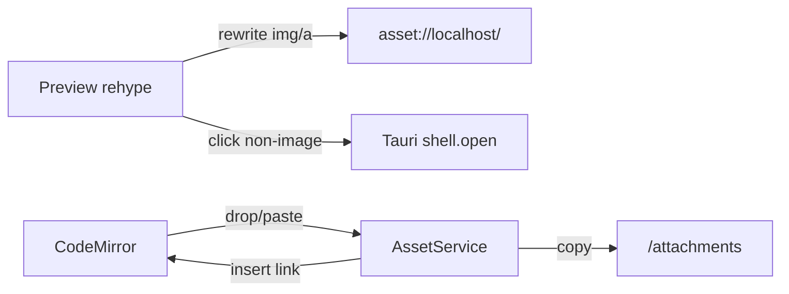

# F11 — Assets & Images Design

## Architecture



## Tauri config

`src-tauri/tauri.conf.json`:
```json
{
  "app": {
    "security": {
      "assetProtocol": {
        "enable": true,
        "scope": []   // populated dynamically per active vault path
      },
      "csp": "default-src 'self'; img-src 'self' asset: data: https:; ..."
    }
  }
}
```

The `scope` is empty in config; on `vault.open`, Rust calls a small command that updates the runtime asset scope to ONLY the current vault's canonical absolute path. This is the security boundary.

Plugin: `tauri-plugin-shell` (already standard) for `shell.open`.

## Components

```
src/features/assets/
  ui/
    BrokenAssetPlaceholder.tsx
    OpenFileConfirm.tsx
  preview/
    rewriteImages.ts      — rehype plugin: rewrites  + <a href> for in-vault paths
    obsidianEmbed.ts      — remark plugin handling `![[file]]` for non-md targets
  services/
    assetResolver.ts      — resolve relative path → absolute, in-vault check
    assetIngest.ts        — drop/paste handlers, write file, build link
  hooks/
    useEditorDropPaste.ts — wires CM6 dom events
src-tauri/src/assets/
  mod.rs                  — set_asset_scope, write_attachment, open_in_default
```

## Resolver rules

```
resolve(linkPath, currentNotePath, vaultRoot):
  if absolute → use directly
  else → join(dirname(currentNotePath), linkPath)
  canonicalize
  if !canonical.startsWith(vaultRoot) → return Blocked
  return Resolved(canonical)
```

For Obsidian `![[name.png]]`:
```
search(name) in vault index ('attachments' folder DB):
  - exact filename match in attachments folder → take it
  - otherwise nearest by directory distance to currentNotePath
  - else None
```
Backed by a new lightweight index: `assets` table with `(path, filename, folder)` populated by F02 walker (extend listing to also pick up known binary types).

## Schema addition

```sql
CREATE TABLE IF NOT EXISTS assets (
  path     TEXT PRIMARY KEY,
  filename TEXT NOT NULL,
  folder   TEXT NOT NULL,
  size     INTEGER NOT NULL,
  mtime    INTEGER NOT NULL
);
CREATE INDEX idx_assets_filename ON assets(filename);
```

Walked extensions (image embedding default): `png jpg jpeg gif webp svg avif pdf mp4 mov mp3 wav`.

## Drop / paste flow

1. CM6 `domEventHandlers.drop` / `paste` capture event, prevent default.
2. For each `File` item, call `assetIngest.write(file, currentNoteFolder, attachmentsFolder)` → returns `{ writtenPath, linkText }`.
3. Insert `linkText` at the editor cursor via CM6 `dispatch`.
4. assetIngest copies via Tauri command `assets.write_attachment(bytes, suggestedName, vaultRelDir)` to keep main thread free.

## Path encoding

Use `encodeURI` on each segment when constructing `asset://localhost/<abs>` to handle spaces and Unicode.

## Open file safelist

```ts
const SAFE_OPEN_EXT = new Set(['pdf','txt','csv','json','mp4','mov','mp3','wav','zip','docx','xlsx','pptx']);
```

## Risks

- **Scope leak** — runtime scope must reset on vault switch and on app close. Add unit test on Rust side.
- **Path traversal** — `..` segments. Always canonicalize before scope check.
- **Asset protocol perf** — Tauri serves files efficiently; large images use `loading="lazy"`.
- **Symlink to outside** — canonicalize follows symlinks; out-of-vault canonical → blocked.
