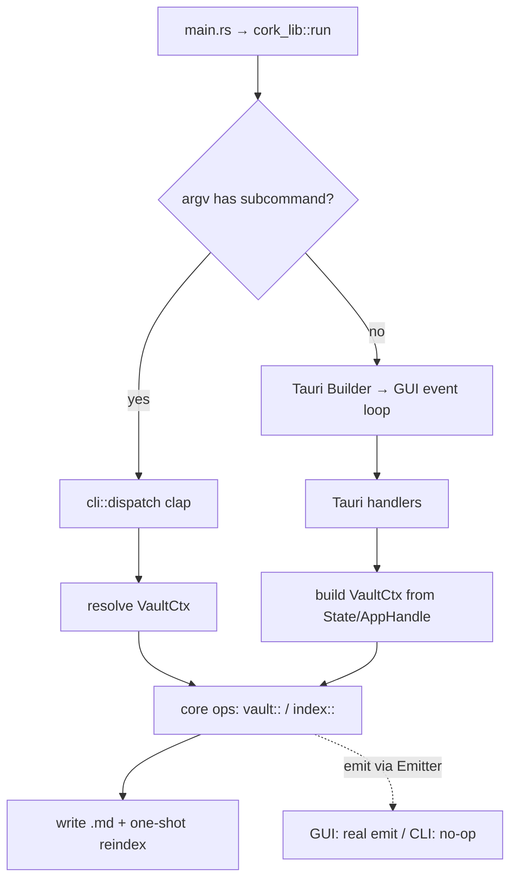

# F48 — Cork CLI Design

**Spec:** `.specs/features/F48-cli/spec.md`
**Status:** Draft

## Principle

The `cork` CLI is **not** a second implementation of vault logic — it is a second _caller_ of the same logic. The GUI's `#[tauri::command]` handlers are thin shells over free functions (`io::`, `rename_propagation::`, `folders::`, `frontmatter::`, `query::`) that already take plain args. We introduce one shared context struct — `VaultCtx` — that both the Tauri `State` layer and the CLI construct, and route the ops through it. The Tauri handlers keep their signatures; internally they build a `VaultCtx` from `State`/`AppHandle` and delegate. The CLI builds a `VaultCtx` from flags + on-disk paths.

We keep **one binary** (dual-mode), matching the existing single-artifact install/update story (AD-050 / `install.sh`): argv decides GUI vs headless.

## Architecture Overview



Both paths converge on the same core ops. The only difference is how `VaultCtx` is built and what `Emitter` does.

---

## Code Reuse Analysis

### Existing logic to leverage (the whole point)

| Logic                               | Location                                                       | How the CLI uses it                                                                     |
| ----------------------------------- | -------------------------------------------------------------- | --------------------------------------------------------------------------------------- |
| Note create/rename/move/trash       | `src-tauri/src/vault/mod.rs`, `io.rs`                          | Call the inner free fns directly via `VaultCtx`                                         |
| Wikilink propagation on rename      | `src-tauri/src/vault/rename_propagation.rs`                    | `retitle` reuses `rewrite_after_rename`                                                 |
| Folder ops                          | `src-tauri/src/vault/folders.rs`                               | `folder *` subcommands                                                                  |
| Frontmatter read/write, tag helpers | `src-tauri/src/vault/frontmatter.rs`                           | `tag add/rm` (per-note), `tag rename/rm-all`                                            |
| Tag CRUD across vault               | `src-tauri/src/index/mod.rs` (`tags_*`), `query.rs`            | `tag rename` / `tag rm-all` reuse `query::tags_rename/tags_delete` + `*_in_frontmatter` |
| Index queries (search/links/lists)  | `src-tauri/src/index/query.rs`, `search.rs`                    | `search`, `links`, `note ls`                                                            |
| Index build / upsert                | `src-tauri/src/index/mod.rs`, `worker.rs`                      | one-shot reindex after mutation (CLI-09)                                                |
| Per-vault db path                   | `src-tauri/src/index/paths.rs` (`index_db_path`, `vault_hash`) | CLI-03 parity                                                                           |
| Recent-vault list                   | `src-tauri/src/vault/mod.rs` (`vault_recent`)                  | CLI-04 fallback resolution                                                              |

### Integration Points

| System                | Integration Method                                                                                              |
| --------------------- | --------------------------------------------------------------------------------------------------------------- |
| SQLite index (AD-004) | CLI opens the **same** `index.sqlite` file the GUI uses, WAL + `busy_timeout`                                   |
| Tauri app_data_dir    | CLI replicates Tauri's identifier-based dir resolution for `com.cork.app`                                       |
| File watcher (GUI)    | CLI does **not** watch; if GUI is running its watcher picks up the CLI's `.md` writes and reindexes on its side |
| `install.sh`          | Adds a `cork` PATH entry on macOS (symlink into the bundle); Linux shim exists                                  |

---

## Components

### `VaultCtx` (core context)

- **Purpose**: The vault + index handle both callers build, replacing `tauri::State`/`AppHandle` inside the ops.
- **Location**: `src-tauri/src/core/ctx.rs` (new `core` module) — or `vault/ctx.rs` if we keep it vault-scoped.
- **Interface**:
  ```rust
  pub struct VaultCtx {
      pub vault_root: PathBuf,
      pub app_data_dir: PathBuf,
      pub fingerprint_cache: Arc<FingerprintCache>,
      emitter: Box<dyn Emitter>,   // GUI = real Tauri emit; CLI = NoopEmitter
  }
  impl VaultCtx {
      pub fn with_conn<T>(&self, f: impl FnOnce(&Connection) -> Result<T, IpcError>) -> Result<T, IpcError>;
      pub fn emit(&self, event: VaultEvent);   // routed through Emitter
      pub fn reindex_paths(&self, paths: &[PathBuf]) -> Result<(), IpcError>;  // one-shot
  }
  ```
- **Dependencies**: `rusqlite::Connection` opened at `index_db_path(app_data_dir, vault_root)`, `FingerprintCache`.
- **Reuses**: `index::paths`, `index::worker` upsert routines, `vault::fingerprint`.

### `Emitter` (event abstraction)

- **Purpose**: Decouple ops from Tauri's `app.emit`. GUI notifications must not be a hard dependency of the logic.
- **Location**: `src-tauri/src/core/emit.rs`
- **Interface**: `trait Emitter { fn emit(&self, event: VaultEvent); }` with `TauriEmitter(AppHandle)` and `NoopEmitter`.
- **Rationale**: In CLI mode there is no window to notify; emits become no-ops. In GUI mode the current `vault:fileChanged` / `vault:fileRenamed` / `index:updated` events fire exactly as today.

### `cli` module (dispatch + commands)

- **Purpose**: Parse argv, resolve the vault, run the matching core op, render output.
- **Location**: `src-tauri/src/cli/mod.rs` (+ `cli/commands/*.rs`, `cli/output.rs`, `cli/resolve.rs`).
- **Interface**: `pub fn dispatch(args: env::Args) -> ExitCode`.
- **Dependencies**: `clap` (derive), `VaultCtx`, core ops, `serde_json` (already present) for `--json`.
- **Reuses**: every op listed in Code Reuse.

### Dual-mode entry (`cork_lib::run`)

- **Purpose**: Branch GUI vs CLI before building the Tauri app.
- **Location**: `src-tauri/src/lib.rs` (modify existing `run`).
- **Logic**: `if cli::is_cli_invocation(&args) { std::process::exit(cli::dispatch(args).into()) }` — else the current Tauri builder path runs unchanged.

---

## CLI grammar

```
cork [GLOBAL] <group> <command> [ARGS]

GLOBAL:
  --vault <path>     operate on this vault (else: nearest vault above cwd, else last recent)
  --json             machine-readable output on stdout
  -h, --help / --version

note   new "<title>" [--folder <p>] [--tag <t>]... [--from-template <name>]
       retitle <path|id> "<new title>"
       mv <path|id> <folder>
       rm <path|id>
       ls [--folder <f>] [--tag <t>] [--status <s>]
       show <path|id> [--frontmatter]
folder new <path> | rename <path> <new> | mv <path> <dest> | rm <path> | ls
tag    add <path|id> <tag>... | rm <path|id> <tag>...
       rename <old> <new> | rm-all <tag> | ls [<path|id>]
search "<query>"
links  <path|id> [--incoming | --outgoing]
reindex
archive <path|id> | restore <path|id> | archive ls          (P3)
completions <fish|zsh|bash>                                   (P3)
```

`<path|id>`: accepts a vault-relative path, an absolute path, or a note id/title resolved via the index. Ambiguous title → error listing candidates (spec edge case).

---

## Vault & db resolution (CLI-03, CLI-04)

1. **Vault root**: `--vault` if given → else walk up from cwd looking for a vault marker (the same signal `vault.open` uses — confirm during T-resolve: scaffold marker / `.cork` dir / presence of the app's vault settings) → else the most-recent entry from the recents store. None found → error.
2. **app_data_dir**: replicate Tauri's resolution for identifier `com.cork.app`:
   - macOS `~/Library/Application Support/com.cork.app`
   - Linux `~/.local/share/com.cork.app` (respect `XDG_DATA_HOME`)
   - Windows `%APPDATA%\com.cork.app`
     Prefer deriving this from a shared helper so GUI and CLI can never diverge. **Verify** the exact dir Tauri 2 produces for this identifier before hardcoding (Knowledge Verification Chain — check `dirs`/Tauri source, don't assume).
3. **db path**: `index::paths::index_db_path(app_data_dir, vault_root)` — identical hash → identical file. If missing, build it first (CLI-09 one-shot).

---

## Concurrency model (CLI-09)

- CLI mutations are **file-first**: write/rename the `.md`, then upsert those paths into the shared index (one-shot, synchronous — no background worker/channel).
- Open the SQLite connection in **WAL** with a `busy_timeout` (e.g. 3s) so a running GUI (single writer + readers) and the CLI don't deadlock; retries absorb the rare lock contention.
- The GUI's watcher independently observes the `.md` change and reconciles its own in-memory view + emits `index:updated`. So with the app open, the CLI's own reindex is belt-and-suspenders; with the app closed, it's the only indexer.
- **Not** attempted: coordinating with an open, dirty editor buffer (documented limitation — the app already handles external-change reload).

---

## Windows console (CLI-11)

The release binary sets `#![windows_subsystem = "windows"]`, which detaches the console → a CLI subcommand would print nothing. In CLI mode, call `AttachConsole(ATTACH_PARENT_PROCESS)` (fallback `AllocConsole`) at the top of `cli::dispatch` on Windows so stdout/stderr reach the invoking terminal. No-op on macOS/Linux.

---

## Install parity (CLI-12)

- **Linux**: already done — `install.sh` writes `~/.local/bin/cork` shim to `AppRun`; passing a subcommand flows straight into dual-mode dispatch. No change beyond confirming argv passthrough.
- **macOS**: the executable lives at `Cork.app/Contents/MacOS/Cork`. Add to `install.sh`: symlink `cork` → that binary into a PATH dir (`/usr/local/bin` if writable, else `$HOME/.local/bin` with a PATH note, mirroring the existing Linux/`/Applications` fallback pattern). Remove the symlink concern on app removal is out of scope for now.
- **Windows**: installer (NSIS/MSI) adds the install dir to PATH or drops a `cork.cmd` shim — detail deferred with the Windows console task.

---

## Error Handling Strategy

| Scenario                        | Handling                                                                     | User sees                                              |
| ------------------------------- | ---------------------------------------------------------------------------- | ------------------------------------------------------ | ------------------------------- |
| No vault resolvable             | Exit 2, message with `--vault` hint                                          | stderr guidance, nothing on stdout                     |
| `<path                          | id>` not found / ambiguous                                                   | Exit 1, no mutation; ambiguous lists candidates        | stderr error (+ candidate list) |
| SQLite locked past busy_timeout | Retry within timeout; then exit 1                                            | "index busy, is another Cork operation running?"       |
| Op error from core (`IpcError`) | Map to exit code + stderr; `--json` → error object on **stderr**, not stdout | consistent with GUI error semantics                    |
| Missing index db                | Build one-shot, then proceed                                                 | transparent (maybe a "building index…" note on stderr) |

---

## Tech Decisions (non-obvious)

| Decision          | Choice                          | Rationale                                                                                                                                                      |
| ----------------- | ------------------------------- | -------------------------------------------------------------------------------------------------------------------------------------------------------------- |
| One binary vs two | **One (dual-mode)**             | Matches single-artifact install/update (AD-050); version-locked; Linux shim already exists                                                                     |
| Arg parser        | `clap` (derive)                 | Standard, generates help + completions; small footprint                                                                                                        |
| Emit decoupling   | `Emitter` trait, no-op in CLI   | Removes the only hard Tauri dependency inside ops; GUI behavior unchanged                                                                                      |
| Reindex strategy  | Synchronous one-shot in CLI     | No watcher/worker lifecycle in a one-shot process; simplest correct path                                                                                       |
| Where core lives  | New `core/` module (ctx + emit) | Keeps the extraction visible and small; avoids a premature crate split. A separate `cork-core` crate can come later if a non-Tauri consumer (MCP) ever appears |

**Deferred:** full `cork-core` _crate_ split. The `VaultCtx`/`Emitter` extraction gets 90% of the benefit inside the existing crate; a crate boundary only pays off if a second binary that must _not_ link Tauri appears (e.g. a future MCP server). Record as a follow-up, don't do it now.

---

## Risks / notes

- **app_data_dir parity is the sharp edge.** If the CLI computes a different dir than Tauri, it silently operates on an empty/parallel index. Must derive from a single shared helper and verify against Tauri 2's actual output for `com.cork.app` before shipping (this is why CLI-03 is P1 foundation, not an afterthought).
- **Vault marker detection** for cwd-based resolution needs to match whatever `vault.open` treats as "this is a vault." Pin this down in the resolve task rather than guessing.
- **Extraction blast radius**: every `#[tauri::command]` in `vault/` + `index/` gets touched to delegate through `VaultCtx`. It's mechanical but wide — do it as its own phase (T-foundation) and keep GUI behavior byte-identical (emits still fire) so nothing regresses.
- **No tests** (project decision): verification is `cargo check` + `pnpm typecheck`/`lint` + manual UAT of each command family with the app both open and closed.
